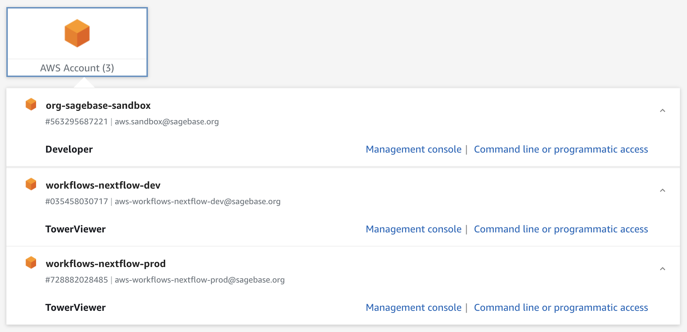

# Nextflow Infrastructure

The AWS infrastructure for hosting a private instance (see link below) of [Nextflow Tower](https://tower.nf/) and executing [Nextflow workflows](https://nextflow.io/) is defined in this repository and deployed using [CloudFormation](https://aws.amazon.com/cloudformation/) via [Sceptre](https://sceptre.cloudreach.com/).

## Access Tower

Click the link below and login with your `@sagebase.org` Google account:

<p align="center">➡️&ensp;<a href="https://tower.sagebionetworks.org/orgs/Sage-Bionetworks/workspaces" target="_blank" rel="noopener noreferrer"><b>Nextflow Tower</b> @ Sage Bionetworks</a>&ensp;⬅️</p>

## Getting Started

### Prospective Tower Users

Follow the [Tower User Onboarding](#tower-user-onboarding) instructions below. Access is currently restricted to Sage Bionetworks staff. **See [below](#getting-help) for how to get help if you run into any issues.**

### Prospective Contributors

Read through the [contribution guidelines](CONTRIBUTING.md) for more information. Contributions are welcome from anyone!

### Getting Help

Message us in the [`#workflow_users`](https://sagebionetworks.slack.com/archives/C8SJHFCKT) Slack channel or email us at `nextflow-admins[at]sagebase[dot]org`.

## Tower User Onboarding

Before you can use Nextflow Tower, you need to first deploy a Tower project, which consists an encrypted S3 bucket and the IAM resources (_i.e._ users, roles, and policies) that Tower requires to access the encrypted bucket and execute the workflow on [AWS Batch](https://help.tower.nf/compute-envs/aws-batch/). Once these resources exist, they need to be configured in Nextflow Tower, which is a process that has been automated using CI/CD.

1. Determine what is known as the stack name by concatenating the project name with the suffix `-project` (_e.g._ `imcore-project`, `amp-ad-project`, `commonmind-project`).

   **N.B.:** Anytime that `<stack_name>` appears below with the angle brackets, replace the placeholder with the actual stack name, omitting any angle brackets.

2. [Create](https://sagebionetworks.jira.com/jira/software/c/projects/IT/issues/) an IT JIRA ticket requesting membership to the following JumpCloud groups for anyone who needs read/write or read-only access to the S3 bucket:

   - `aws-sandbox-developers`
   - `aws-workflow-nextflow-tower-viewer`

   To confirm whether you're already a member of these JumpCloud groups, you can expand the AWS Account list on [this page](https://d-906769aa66.awsapps.com/start#/) (after logging in with JumpCloud) and check if you have `Developer` listed under `org-sagebase-sandbox` and `TowerViewer` under `workflows-nextflow-dev` and `workflows-nextflow-prod`.

   

3. Open a pull request on this repository in which you duplicate [`config/projects/example-project.yaml`](config/projects/example-project.yaml) as `<stack_name>.yaml` in the `projects/` subdirectory and then follow the numbered steps listed in the file. Note that some steps are required whereas others are optional.

   **N.B.** Here, read/write vs read-only access refers to the level of access granted to users for the encrypted S3 bucket and to the Tower workspace (more details below). **Given that access is granted to the entire bucket, you might want to create more specific Tower projects that provide more granular access control.**

   **Getting Help:** If you are unfamiliar with Git/GitHub or don't know how to open a pull request, see [above](#getting-help) for how to get help.

4. Once the pull request is approved and merged, [confirm](https://github.com/Sage-Bionetworks-Workflows/aws-workflows-nextflow-infra/actions?query=event%3Apush+branch%3Amain) that your PR was deployed successfully. If so, the following happened on your behalf:

   - An S3 bucket called `s3://<stack_name>-tower-bucket/` was created, and users listed under `S3ReadWriteAccessArns` and `S3ReadOnlyAccessArns` have read/write and read-only access, respectively.

   - All users listed under `S3ReadWriteAccessArns` and `S3ReadOnlyAccessArns` were added to the Sage Bionetworks organization in Tower.

   - A new Tower workspace called `<stack_name>` was created under this organization.

   - Users listed under `S3ReadWriteAccessArns` were added as workspace participants with the `Maintain` role, which grants the following permissions:

     > The users can launch pipeline and modify pipeline executions
       (e.g. can change the pipeline launch compute env, parameters,
       pre/post-run scripts, nextflow config) and create new pipeline
       configuration in the Launchpad. The users cannot modify Compute
       env settings and Credentials

   - Users listed under `S3ReadOnlyAccessArns` were added as workspace participants with the `View` role, which grants the following permissions:

     > The users can access to the team resources in read-only mode

   - A set of AWS credentials called `<stack_name>` was added under this Tower workspace.

   - An AWS Batch compute environment called `<stack_name> (default)` was created using these credentials with a default configuration that should satisfy most use cases.

   **N.B.** If you need have special needs (_e.g._ more CPUs, on-demand EC2 instances, FSx for Lustre), see [above](#getting-help) for how to contact the administrators, who can create additional compute environments in your workspace.

5. Log into Nextflow Tower using the [link](#access-nextflow-tower) at the top of this README and open your project workspace. If you were listed under `S3ReadWriteAccessArns`, then you'll be able to add pipelines to your workspace and launch them on your data.

6. Acknowledge the following details:

   - **Uploading Files:**  To upload files to your project bucket (_i.e._ `s3://<stack_name>-tower-bucket/`), you need to use the `bucket-owner-full-control` canned ACL. Otherwise, you will get `Access Denied` errors. Using the AWS CLI, this would look like:

     ```console
     # Make sure that you are logged in with the right account/role
     # Compare the Arn with what's listed in `<stack_name>.yaml`
     aws sts get-caller-identity

     # Uploading a single file
     aws s3 cp /path/to/file.txt s3://<stack_name>-tower-bucket/ --acl bucket-owner-full-control

     # Uploading an entire folder
     aws s3 cp /path/to/folder/ s3://<stack_name>-tower-bucket/ --acl bucket-owner-full-control --recursive

     # Syncing between buckets
     aws s3 sync s3://some-bucket/data/ s3://<stack_name>-tower-bucket/ --acl bucket-owner-full-control
     ```

   - **Reference Files:** Sage Bionetworks has mirrored a subset of human and mouse reference files from the [nf-core iGenomes bucket](https://ewels.github.io/AWS-iGenomes/). These are found in the public `s3://sage-igenomes` S3 bucket, which **can only be accessed from the `us-east-1` region** (all other requests will be denied). If you're running nf-core pipelines, you should set the `--igenomes_base` parameter to `s3://sage-igenomes/igenomes`.

## License

This repository is licensed under the [Apache License 2.0](LICENSE).

Copyright 2021 Sage Bionetworks
